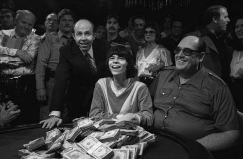
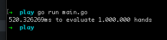

# Ungar

## Texas Hold'em 7-hand poker hand evaluator

### Reasoning
There's a lot of poker hand evaluators out there but almost all of them are 5-card hand evaluators which (in my opinion) is unusable because:
* evaluating a 5-card hand means that you have *already* selected the best 5-card combination out of the 7 given hards
* you will need repeat the evaluation 21 times in case you need to choose the best possible combination

All the 7-card evaluators that I found online required enormous tables and pretty hairy code so I decided my make my own that would be nice and simple. From the start I make a desicion that I would prioritize speed over memory cost as I wanted my algorithm to be able to evaluate as many hands as possible.

### Card representation
I decided to represent a card as a union of two primes: one for suit and another one for value. Suit primes (2, 3, 5, 7) would require 3 bits to encode and value primes (2, 3, 5, 7, 11, 13, 17, 19, 23, 29, 31, 37, 41) would require 6 bits to encode. I'd spent a few hours thinking how can I make it fit into 8 bits but I didn't come up with a good solution so I finally encoded cards as **uint16** (unavoidable pain).

### Ranking
There are about 130+ million possible 7 card combinations but only 7462 unique 5-card values. You must have realized already that would I use primes to encode cards in order to have unique product that I would be able to use as keys for a lookup table mapping the product to a 5-card value. I had to precompute the unique product for each 5 card combination plus 2 more cards. Interestingly enough, I realized that not all of the 5-card combinations are actually possible to have when you have to choose the best combination out of 7 cards. For example the worst possible hand: 2-3-4-5-7 unsuited is actually can NEVER happen as if you have 7 cards - you have no choice but to improve: any card of 2, 3, 4, 5 or 7 would give you a pair; a 6 or an Ace would give you a straight, anything else would just make it a bigger value high card.

### Algorithm
You first have to check if you have a flush because if you do, then you might have a straight flush. In order to check for a flush we find product of the suit primes and use it in the Suits lookup table. The table maps product to suit. If we have a flush then we iterate over the cards of the flush suit and gather them all into another array in order to later get the product of only the suited cards values. This product is used in another lookup table called Values. If we have a flush and a straight - then it's a straight flush. If there's no straight then we have to use suited cards product in third lookup table called Flushes. It's values are almost like high card expect for they are not high card but flushes. In case there's no flush - we have to check for the the all 7-card values in the Values lookup table.

### Pseudo code:
```
flush = check_flush(hand);
if flush:
    suited_cards = extract_suited_cards(hand)
    straight = check_straight(suited_cards)
    if straight:
        total_value = straight * flush
    else:
        total_value = flush
else:
    total_value = get_value(hand)
return total_value
```

### Results
I implemented this algorithm in Go and the results are pretty impressive for my perspective:    
    
    1 million hands evaluated per half a second.

### PS
I'd appreciate any comments, questions are critique. You are more then welcome to fill up an issue or drop me a line to [avvolob@gmail.com](mailto:avvolob@gmail.com)
